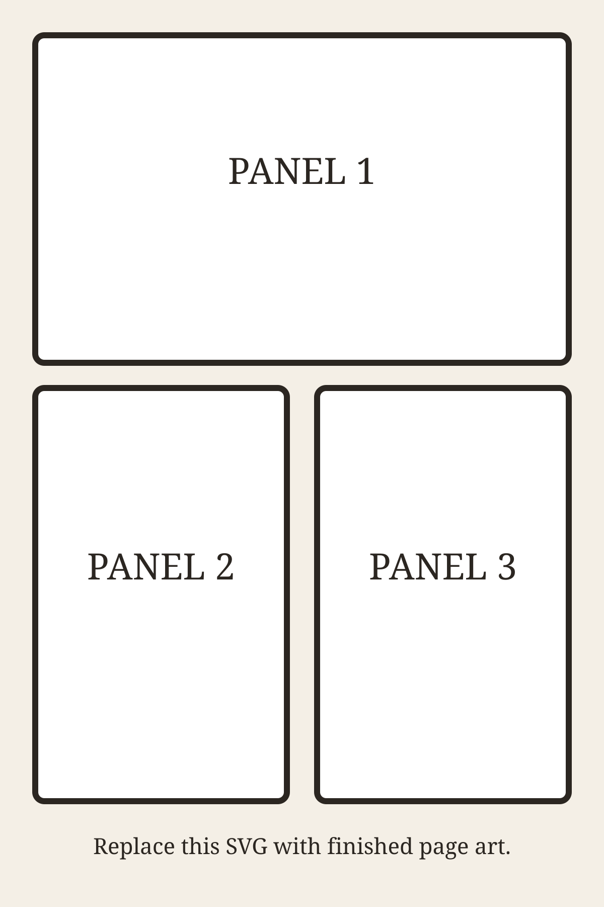

# Comic Title — Issue 1

## Page 1

Replace the placeholder above with finished page art. For a page-by-page comic, repeat the image line for each page in reading order. For panel-by-panel work, use one image per panel and keep the Markdown sequence identical to the intended reading sequence.

## Credits

List writing, art, colors, lettering, editing, translation, and other production credits here. Add prior-publication or rights notes when they belong with the released issue.
