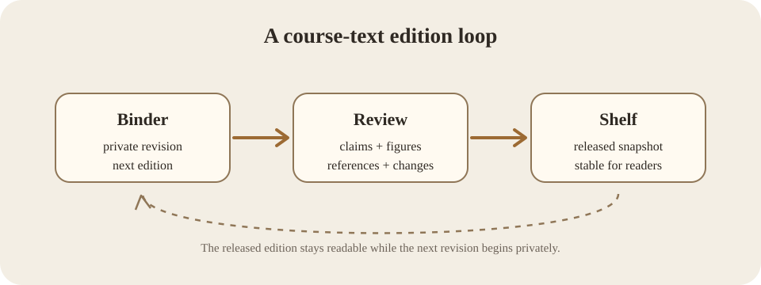

# Academic Apparatus in Plain Markdown

A textbook has to do more than carry paragraphs. It has to distinguish the author's claim from the source behind it, keep explanatory notes out of the main line when they would interrupt the argument, give figures enough context to stand on their own, and let a reader return to an equation without hunting through pages. None of those needs requires the manuscript to stop being plain text.

**Learning objectives**

After working through this chapter, a student should be able to:

- write a footnote whose source remains visible and reviewable in Markdown;
- connect an author-year citation to a bibliography entry without a separate reference database;
- explain the difference between alternative text and a figure caption;
- label a display equation and refer back to its generated number;
- identify which scholarly conveniences belong in core Bookself and which belong in an optional full-TeX workflow.

The point of academic apparatus is not ornament. A citation tells the reader where an argument can be checked. A caption tells the reader what a figure is doing in the chapter. A footnote makes room for a qualification that matters without forcing every reader through it at the same moment. A numbered equation gives a shared name to a mathematical object. These devices make a text easier to inspect, discuss, and revise.

Bookself treats each of them as part of the manuscript. That is consistent with the way Git already treats a publication: the useful unit is not merely the sentence on screen but the source that can be compared with an earlier source. A commit is a named snapshot of that source, and the history records how one snapshot followed another [@progit|Chacon and Straub, 2014].

**Key terms**

| Term | Meaning in this course |
|---|---|
| **Footnote** | A numbered note connected to a marker in the chapter text. |
| **Citation key** | A stable author-facing identifier that connects an inline citation to its bibliography entry. |
| **Figure caption** | Visible explanatory text attached to a figure; it is not a substitute for image alt text. |
| **Equation label** | A stable source identifier attached to a display equation so prose can refer to its generated number. |
| **Academic apparatus** | The supporting system of notes, citations, references, figures, and cross-references around the main argument. |

Consider the semester-edition workflow from the previous chapter. While students are reading one released edition, the instructor may already be changing examples and references in a private Binder. The public copy should not wobble each time the working copy changes.[^stability] A compact picture of the relationship makes the distinction easier to see.

The same relationship can be written as a small piece of notation. Let $E_t$ be the released edition used in term $t$, and let $\Delta_t$ be the set of accepted changes prepared for the next release. Define `apply` as the operation that produces a new edition from those reviewed changes:

$$
E_{t+1} = \operatorname{apply}(E_t, \Delta_t)
\label{eq:edition-transition}
$$

Equation \eqref{eq:edition-transition} is not a statistical law. It is notation for the publishing operation described in prose: the next edition begins from an identifiable released state and a reviewable set of accepted changes. Giving that relationship a label means later paragraphs can refer to the object rather than repeat the expression.

There are two useful identities here. The TeX label `eq:edition-transition` is for the author and Git history; the visible equation number is for the reader. The label can remain stable even if an earlier equation is inserted and the displayed number changes. Footnotes and citations use the same separation between stable source keys and reader-facing presentation.

A footnote marker is written as a key in square brackets. Its definition can sit later in the chapter, where a reviewer can inspect or revise it like any other sentence. Citations follow a similar pattern: the prose supplies a stable key and the visible author-year label, while a definition under References holds the full entry. This first layer leaves citation style in the author's hands rather than quietly normalizing a field's conventions.

That modesty matters. An economics text, a history monograph, and a physics preprint do not share one citation culture. Automatically converting all three to an invented house style would create the appearance of rigor while discarding authorial and disciplinary decisions. Bookself can make references navigable without pretending it has become a reference manager.

The same restraint applies to figures. Alternative text describes the informative content for a reader who cannot see the image. The caption explains why the figure is present, how it should be read, or where it came from. A good academic figure may need both, and they should not be collapsed into one string merely because both happen to be near an image.

**Worked example**

Imagine that an instructor discovers that Figure 5.1 is misleading because the review stage is more iterative than the diagram suggests. The correction can be one bounded proposal: revise the SVG, revise the caption, and change the paragraph that interprets it. A reviewer sees the visual source and the explanatory source together. If the revision also changes a claim supported by a reference, the bibliography entry can travel in the same diff.

Nothing in that review requires a document compiler. The browser still reads Markdown and repository media. Git still records ordinary files. The Reader contributes presentation and navigation without becoming the only place where the scholarly structure exists.

**Discussion questions**

1. Why is a stable citation key useful even when the visible citation style may change?
2. What information belongs in image alt text that does not necessarily belong in a figure caption, and vice versa?
3. Why might chapter-local equation numbering be a better first implementation than a hidden book-wide reference database?
4. Which academic features would justify an optional full-TeX workflow rather than another Markdown convention?

**Lab: inspect the apparatus as source**

Open this chapter in the repository rather than the Reader. Find the source for Figure 5.1, the footnote marker and its definition, the inline citation and its bibliography definition, and the `\label` / `\eqref` pair. Change one visible label in a branch without changing its stable key. Then inspect the diff. The exercise is complete when you can explain which parts are reader-facing presentation and which identifiers are there to keep the source addressable across revisions.

[^stability]: Stability here means that the assigned Shelf snapshot does not change merely because work has begun on its successor; an instructor can still choose an explicit public hotfix when a live correction is necessary.

## References

[@progit]: Chacon, Scott, and Ben Straub. *Pro Git*. Second edition. Apress, 2014.
