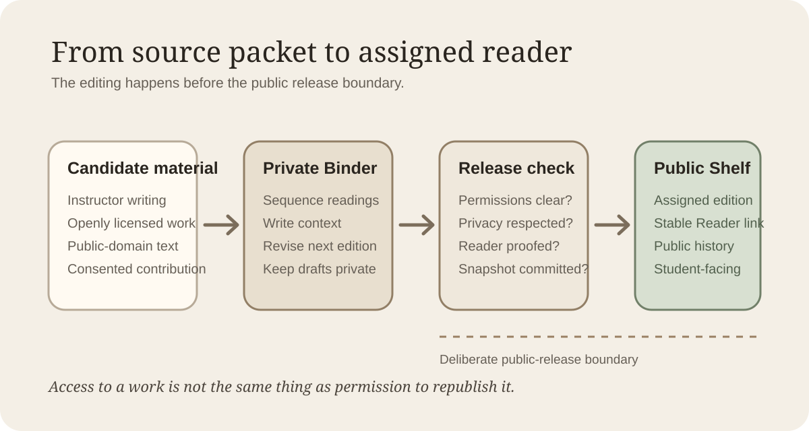

# Course Readers as Anthologies

A course reader is an editorial object, not merely a pile of links. The instructor decides what belongs together, what order creates a useful conversation, what context students need before each selection, and which version of the collection the class is actually expected to read.

Bookself's anthology shape is useful when that collection should behave like a publication rather than a bookmark folder. The source material may include instructor-written notes, openly licensed readings, public-domain texts, student work published with permission, or short original contributions created for the course. The important distinction is that Bookself does not grant permission to republish material. The editor still has to know what may legally and ethically be included in a public Shelf.

**Learning objectives**

After working through this chapter, a student should be able to:

- explain when a course reader benefits from an anthology structure;
- distinguish editorial context from the contributed works it surrounds;
- identify permissions and privacy questions before a collection is released publicly;
- describe how a private Desk can hold the next reader while students continue using the current Shelf edition;
- explain why a stable public collection is useful for discussion, citation, and semester-to-semester teaching.

Consider a seminar called *Ways of Seeing Evidence*. Professor Chen wants students to read three short pieces together: an instructor-written field note, an openly licensed methods essay, and a student reflection from a previous term whose author has explicitly agreed to publication. The value is in the sequence. The first piece asks students to notice what counts as evidence, the second gives them a vocabulary for evaluating it, and the third shows how another student struggled with that vocabulary in practice.

A generic list of URLs could deliver all three items. An anthology can do more. It can give the collection a title, introduce the editorial idea, place each contribution in a deliberate order, keep contributor notes and permissions information with the edition, and provide one Reader surface for the class.

**Key terms**

| Term | Meaning in this course |
|---|---|
| **Course reader** | A curated collection of readings assembled for a class or program. |
| **Anthology** | A publication organized around multiple works or contributors under one editorial frame. |
| **Editorial note** | Context supplied by the editor to explain why a work is included or how it relates to the collection. |
| **Permission record** | The durable note that explains why the editor is allowed to publish a contributed work or media item. |
| **Assigned edition** | The public Shelf snapshot the class is expected to use during a particular teaching period. |

The private Desk is where Professor Chen can assemble the next version. She can reorder pieces, revise the introduction, remove an item whose permission is uncertain, or prepare a new contribution without changing what the current class sees. None of that requires the Shelf edition to become a work in progress.

This matters most when the collection includes other people's work. A useful editorial workflow separates **can I access this?** from **may I republish this?** A journal article available through a university library may be readable by enrolled students without being licensed for public redistribution. A student's paper may be excellent without being appropriate to publish under the student's name. A photograph found on the open web may still be copyrighted. Bookself's plain files make provenance easy to record, but they do not replace rights review, institutional policy, or informed consent.

For a public course reader, the safest materials are those the editor wrote, works whose license clearly permits the intended reuse, public-domain material, and contributions whose authors have deliberately agreed to the release terms. When material cannot be republished, the anthology can still contain the instructor's own context and link students to the lawful source instead of copying it into the repository.

The anthology starter keeps a new collection in one manuscript file. That is often enough for a short seminar reader because the Reader can expose the section headings as navigation. If a collection grows large, or if individual contributions need separate review histories, the editor can later split works into separate manuscript files. Structure should follow editorial work rather than precede it.

**Worked example**

Professor Chen prepares the fall reader on her private Desk. The introduction explains the course's central question. Each contribution begins with a short editorial note identifying the author, why the piece is present, and any reading question the class should carry into it. At the end of the manuscript she keeps contributor notes and a public-facing permissions statement appropriate to the material being released.

Before release she checks three things. First, every included work has a clear publication basis. Second, no private student information or classroom-only feedback has leaked into the manuscript. Third, the collection reads coherently in the Reader rather than merely appearing complete in the source files.

She commits that state and releases it to the public Shelf. The syllabus links the Reader edition students should use. During the semester she notices that the second contribution needs a better introduction and begins revising it on the Desk, but she leaves the assigned Shelf collection stable. When spring approaches, she can release a revised anthology as the next edition.

That separation gives a professor room to edit while giving students a dependable shared object. Everyone can refer to the same sequence, headings, notes, and public revision history. If exact provenance matters for a paper or research project, the public Shelf commit can identify the precise assigned state.

**A compact editorial checklist**

Before releasing a course reader, ask:

1. Is every included work mine to publish, openly licensed for this use, public domain, or accompanied by explicit permission?
2. Have student names, submissions, grades, comments, and other educational records been handled according to the actual consent and privacy requirements that apply?
3. Does each contribution have enough context to explain why it belongs in this collection without speaking over the contributor?
4. Can a student tell which edition is assigned without seeing the next semester's work in progress?
5. Have links, media, contributor notes, and acknowledgments been checked in the Reader itself?

**Lab: design a small course reader**

Choose a real or imagined seminar topic and plan a three-item reader. For each item, write one sentence explaining its editorial role and one sentence explaining the publication basis you would need before placing it on a public Shelf. Then arrange the items in the order you would want students to encounter them and write a short introduction explaining the sequence.

If one item cannot lawfully or ethically be republished, do not treat that as a failure. Keep the editorial note in the reader and make the source an external link. A good anthology is not the collection that copies the most material. It is the collection that makes its editorial choices, permissions, and assigned edition legible.
