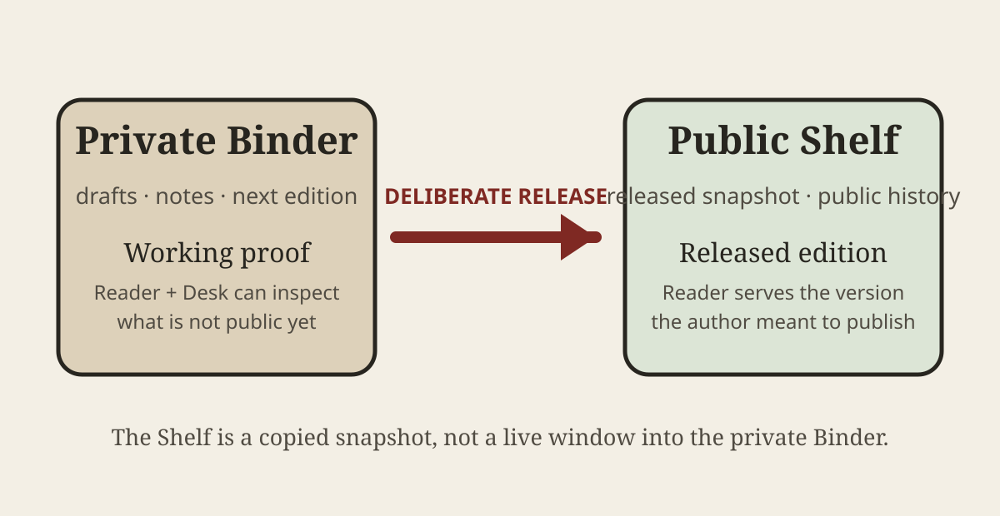

# The Bookself Daily — Platform Edition

A newspaper is a useful stress test for Bookself because the shape is different from a book without requiring a different publishing system. An edition still needs a title, a date, a clear hierarchy, room for images and data, and a visible place to correct the record. Underneath, it is still a folder of ordinary files.

## Front page

### Publication workflows get a clearer front page

The most important boundary in Bookself is not a technical one. It is the moment an author decides that work in progress is ready to become public.

A Binder is the private work room. Drafts, experiments, review notes, and the next edition belong there. A Shelf is the public bookcase. It contains a copied snapshot the author deliberately released. The Shelf does not reach back into the Binder, and later Binder changes do not silently alter what readers already have.

That separation matters for a newspaper as much as for a book. An editor can prepare tomorrow's edition privately while today's released issue stays stable. A professor can prepare next semester's course text without changing the edition students were assigned. A researcher can revise a report without presenting the revision as already published.

The Reader can show both sides of that lifecycle. In a private Binder it is a proofing surface. On a public Shelf it is the reading surface for released work. The software is shared; the repository role and publication state are what change.

## Campus desk

### Next semester's draft should not replace this semester's reading

Course materials are unusually sensitive to edition drift. Instructors often improve a text while a class is still using the previous version. If the public reading link simply followed the latest draft, a paragraph could change between a lecture and an assignment without students doing anything wrong.

Bookself's answer is deliberately plain: revise in the private Binder and leave the current Shelf snapshot alone. When the next edition is ready, release a new snapshot. For an exact semester record, an instructor can retain the public Shelf commit alongside the normal Reader link.

The same pattern works for an edition-based newspaper. Tomorrow's corrections and additions can be prepared privately without rewriting yesterday's published artifact in place.

## Reader lab

### Format metadata changes presentation, not ownership

This edition uses `Format: Newspaper`. The Reader recognizes that metadata and can label the publication as an edition rather than pretending every long-form artifact is a conventional book. Magazine, journal, newsletter, anthology, report, manual, comic, paper, and book formats use the same underlying Markdown-and-media model.

That means format is presentation and semantics, not a second storage system. The author does not need a newspaper database, a magazine service, or a special build pipeline just to get an issue into the Reader.

| What the artifact needs | Where Bookself keeps it |
|---|---|
| edition title and date | publication `README.md` |
| articles and departments | Markdown under `manuscript/` |
| cover and figures | that publication's `media/` folder |
| revision history | Git |
| working proof | private Binder Reader |
| released edition | public Shelf snapshot |

## Around the desk

### A correction is both history and communication

Git remembers that a file changed, but ordinary readers should not have to inspect a commit diff to learn that a material error was corrected. That is why the newspaper starter includes a visible corrections section.

The two records serve different jobs. Git preserves the technical history of the file. The edition itself tells readers what changed in language meant for readers. A newsroom can use both without asking either one to impersonate the other.

### One engine, several publication shapes

The point of the specimen shelf is not to claim that a newspaper, a scholarly journal, and a comic should look identical. It is to show how far a small set of durable primitives can go: Markdown, media files, metadata, Git history, and a Reader that understands publication shape.

A useful template should make the first blank page easier. A useful specimen should go one step further and let an author open something finished enough to see what the template can become. This edition exists for that second job.

## Corrections and notes

This is a platform teaching specimen, not a report of outside events. It describes Bookself's own documented workflow and is intentionally public inside the Bookself repository.

No corrections have been recorded for this edition.
