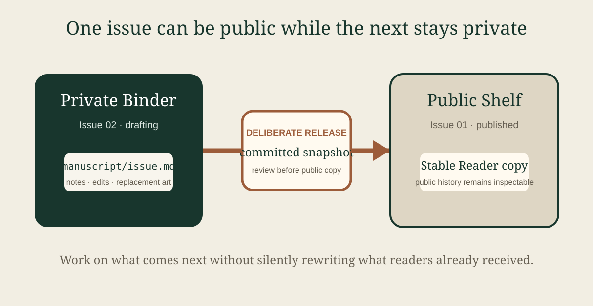

# Dispatch 01 — The release boundary

A newsletter has a different rhythm from a book. It arrives with a date, assumes some continuity, and mixes short items with one or two things worth lingering over. That makes it a useful Bookself specimen: the publication shape changes while the underlying source stays ordinary Markdown and media.

## From the editor

The most useful Bookself idea is also the easiest one to blur: writing and publishing are different acts.

A private Binder is where work can still be wrong. Sentences move, figures get replaced, next month's issue starts before this month's has finished circulating. A public Shelf is where an author puts the snapshot they are prepared to stand behind. Releasing copies that committed snapshot across the boundary; it does not turn the Shelf into a window on the Binder.

That distinction is especially natural for a newsletter. Issue 2 can be half-written in private while Issue 1 remains exactly what readers received.

## Three short notes

### A stable link is not the same thing as a moving draft

Readers should not need to wonder whether yesterday's assigned text changed overnight. The Reader link can stay familiar while the public repository history records exactly which snapshot was released. For a course, an instructor can retain the public Shelf commit alongside the normal Reader link when an exact semester edition matters.

### Small publications still deserve history

A six-paragraph dispatch may feel too small for version control until the first typo is fixed, a chart changes, or an editor needs to recover a paragraph cut last week. Git does not become useful only after a manuscript reaches book length. The smaller the artifact, the easier it is to see the value of a clean history.

### Distribution can remain separate from source

A Bookself newsletter can also be sent through email, mirrored on a website, or linked from a mailing-list archive. Those distribution channels do not have to become the source of truth. The publication folder can remain the durable source while `Find elsewhere` points readers to legitimate copies or subscription surfaces.

## Feature: what a released issue actually contains

For a recurring publication, the release boundary is less about ceremony than about preventing two timelines from collapsing into one.

The working timeline contains edits that readers have not agreed to receive yet: a revised headline, a paragraph waiting on review, a note for the next issue, a replacement image. The released timeline contains the issue as published. Keeping those states separate gives an editor room to continue working without silently changing the artifact already in circulation.

| Moment | Private Binder | Public Shelf |
|---|---|---|
| Draft the next issue | yes | no |
| Review unfinished copy | yes | no |
| Keep the current released issue readable | optionally, as working source | yes |
| Publish a committed snapshot | source of release | receives the copy |
| Revise after publication | prepare replacement privately | stays stable until next release |

There is no requirement for a hosted build pipeline between those columns. The manuscript, its media, and its Git history are enough to support the normal path. A mail provider or CMS can still sit downstream if the publication needs one, but it does not have to own the writing lifecycle.

## Worth keeping nearby

- The Reader is for reading and proofing; the Publishing Desk is for readiness and release-oriented inspection.
- Personal Reader notes stay local to the reader's browser unless deliberately exported.
- Publication artwork belongs beside the manuscript in `media/`, so it travels with the same snapshot.
- A released issue can link to an external archive or subscription page without making that service a Bookself dependency.

## Housekeeping

This is a deliberately public platform specimen, not a real mailing list and not a copy of a private Binder. It exists to show what the blank newsletter starter can become inside the normal Reader.

For an actual publication, start from `_NEWSLETTER_TEMPLATE` in a private Binder, keep the issue `Drafting` while it is in progress, and release a committed snapshot only when it is ready to be public.
