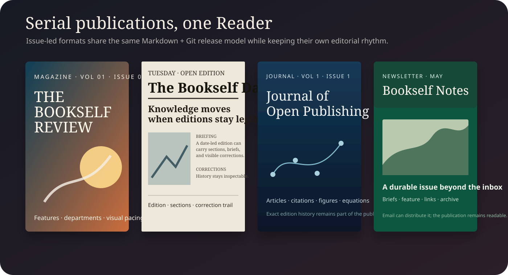
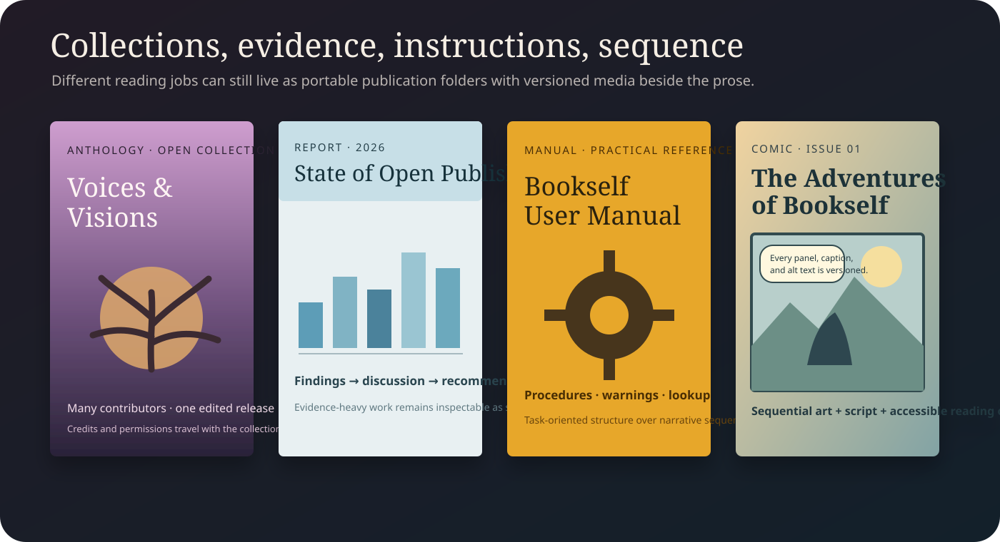

# The publication family

Bookself does not need every kind of writing to pretend it is a book. The same plain-file substrate can carry different editorial rhythms while the Reader supplies format-aware presentation.

A useful way to choose is to ask what the reader is arriving to do. Is this an issue they will skim on a date, a paper they will audit, a procedure they will return to, or a collection they will browse in more than one sitting? The format should make that job feel natural before the reader learns anything about the repository behind it.

| Reader arrives to… | A good starting format | Typical shape |
|---|---|---|
| Browse a curated issue | Magazine | departments, features, visual pacing |
| Catch up on a dated edition | Newspaper | front page, sections, briefs, corrections |
| Evaluate scholarly work | Journal | volume/issue metadata, articles, citations, figures |
| Read a compact recurring dispatch | Newsletter | editor note, briefs, feature, links |
| Move among several contributors | Anthology | introduction, contributor works, notes |
| Understand evidence and decisions | Report | executive summary, method, findings, recommendations |
| Complete or troubleshoot a task | Manual / handbook | prerequisites, procedures, warnings, reference |
| Follow sequential visual storytelling | Comic / graphic narrative | ordered pages, art, script, alt text |

## Magazine

Issue-led, image-forward, and curated. Use `_MAGAZINE_TEMPLATE` when departments, features, volume/issue metadata, and visual pacing matter.

A magazine issue might open with an editor's note, move through two short departments, then give most of its space to one illustrated feature. The point is not that every issue needs those exact parts. It is that the issue itself is the editorial unit: a reader should be able to recognize what belongs together.

## Newspaper

Date-led and correction-friendly. `_NEWSPAPER_TEMPLATE` is for editions, briefs, sections, and an explicit correction trail.

A newspaper reader often wants orientation before depth, so the edition can lead with the strongest story, group shorter pieces by desk or section, and keep corrections visible instead of silently rewriting history. The publication date matters because tomorrow's edition is a different object.

## Journal

Volume-and-issue scholarly publishing. `_JOURNAL_TEMPLATE` pairs naturally with Bookself's citations, figures, equations, and exact-edition history.

A journal issue can contain one research note or several articles, but each claim should remain inspectable: methods, references, figures, equations, and revision history belong close enough to the text that a student or reviewer can follow the evidence rather than trusting a polished surface.

## Newsletter

Compact serial publishing. `_NEWSLETTER_TEMPLATE` keeps an issue readable as a durable publication even when email is also a distribution channel.

Think of the newsletter as the edition of record rather than the inbox message. A brief editor note, a handful of short items, one deeper piece, and useful links are often enough. The next issue can be drafted privately while the released issue stays unchanged on the Shelf.

## Anthology

Many voices in one collection. `_ANTHOLOGY_TEMPLATE` gives contributors and editors a shared release surface without requiring a database.

An anthology can begin with an editorial introduction, then give each contribution a clear title and author boundary. That makes it useful for a class reader, conference collection, literary gathering, or edited volume where the collection has one identity but the pieces should not lose theirs.

## Report

Executive summary, findings, evidence, and recommendations. `_REPORT_TEMPLATE` works for institutional, research, and public-interest reports.

A report should let a hurried reader understand the main finding without making the evidence disappear. Put the short version up front, then show scope, method, findings, uncertainty, and any recommendations in enough detail that another reader can audit how the conclusion was reached.

## Manual / handbook

Task-oriented reference material belongs in `_MANUAL_TEMPLATE`, where procedures, warnings, examples, and lookup-friendly sections matter more than narrative flow.

Manual readers rarely arrive at page one and continue politely to the end. They arrive with a job or a problem. Name prerequisites before the procedure, keep steps in the order they must happen, and organize troubleshooting around observable symptoms so the publication remains useful on the third visit as well as the first.

## Comic / graphic narrative

`_COMIC_TEMPLATE` keeps sequential art beside its script and alt text, so images and reading order are versioned together.

For a comic, page order is part of the manuscript. Keep the image asset, its accessible description, and any script or production notes together so a revision to the art does not become detached from the text that explains what the page is meant to communicate.

The important boundary is unchanged: these are authoring starters in a private Binder. Copy the closest starter to a normal publication slug, replace its placeholder material, and proof the result there. Only an intentionally released publication belongs on a public Shelf.
