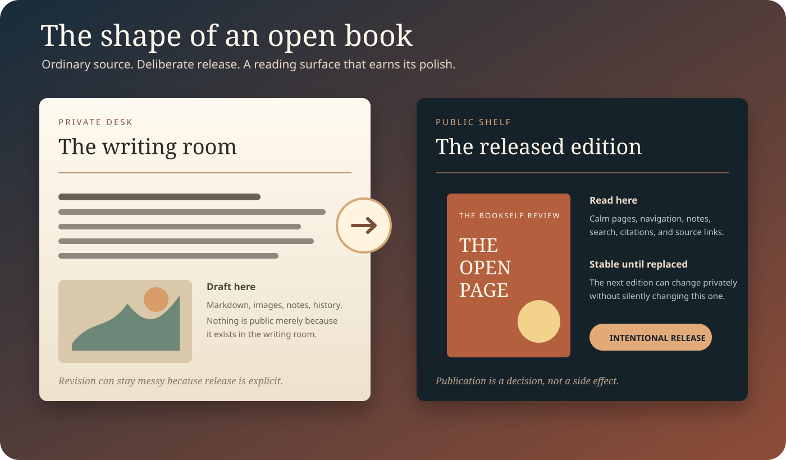

# The Open Page

*Ideas, tools, and insights for authors.*

## From the editor

A magazine should feel curated rather than merely concatenated. This specimen keeps the source intentionally simple—one Markdown issue, versioned media, and publication metadata—but gives the issue enough editorial shape to demonstrate what a magazine can actually feel like in the Reader.

This first issue asks a practical question: how can a publication look intentional without making its source fragile?

## Feature — The shape of an open book

Open publishing works best when the writing surface stays ordinary and the reading surface earns its polish. The manuscript remains portable text. The Reader supplies hierarchy, atmosphere, navigation, notes, and a cover without turning the publication into a proprietary bundle.

The useful tension is that the issue can be visually specific while the source stays boring in the best possible way. A writer can keep drafts, experiments, image revisions, and the next issue on a private Desk. A released issue can remain stable on the public Shelf until the editor deliberately replaces it.

That separation changes the emotional texture of revision. Authors do not have to choose between never publishing and silently editing the thing readers already saw. They can keep working privately, compare versions, invite review, and publish the replacement when it is ready.

## Three things worth keeping

**Source that survives the tool.** The issue is Markdown plus ordinary media files. If the Reader disappeared tomorrow, the publication would still be understandable and recoverable.

**A release readers can trust.** Public Shelf content is there because somebody chose to release it. The next revision does not leak merely because work has started on it.

**A reading surface with taste.** Portability does not require visual indifference. Typography, page rhythm, illustrations, captions, issue metadata, and navigation can all make the experience feel authored without changing the manuscript into a proprietary format.

## By the numbers

| Part of this issue | Stored as | Reader job |
|---|---|---|
| Feature prose | Markdown | Type, paginate, search, navigate |
| Feature artwork | SVG in `media/` | Display with alt text and caption |
| Issue identity | README metadata | Label the publication as a magazine issue |
| Revision history | Git | Show what changed and when |

The table is intentionally mundane. A publication system earns trust when the polished result can still be explained in plain parts.

## Desk notes

The released issue is not the newsroom. A future issue can be drafted privately on the Desk while this edition remains stable on Shelf. Corrections and replacements stay deliberate, reviewable changes rather than invisible CMS edits.

For editors, that means the Desk can answer a different question from the Reader. The Reader asks, “Does this feel good to read?” The Desk asks, “Is this the version we mean to release?” Keeping those questions separate is one of Bookself’s most useful design constraints.
