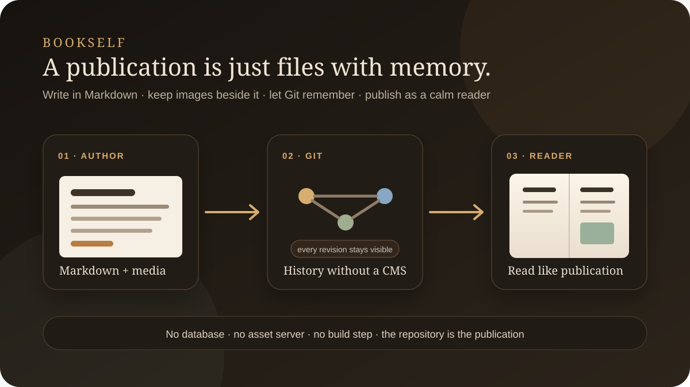
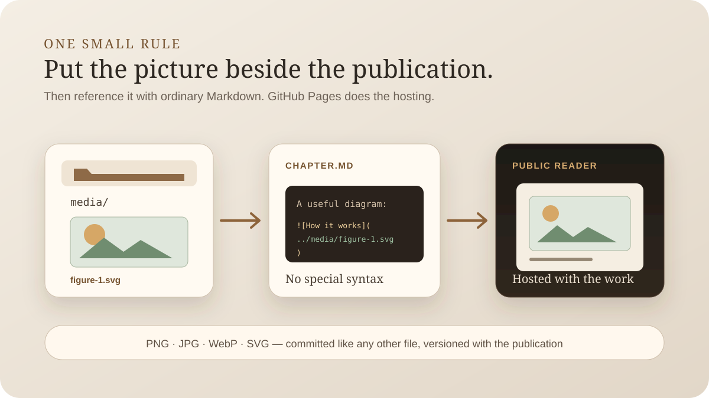

# Opening the Binder

This book is sitting inside the system it describes. Its source is a folder in the Bookself repository. The chapters are Markdown files, the figures sit beside them in `media/`, and Git remembers the versions. The Reader does not receive a special exported copy; it reads these files and turns them into pages.

That is the smallest useful idea in Bookself: a publication should still look like a publication when all the publishing software is removed.

A chapter is one file. Its first line is the title. Images are ordinary relative Markdown links. Put a PNG, JPG, WebP, or SVG in the book's `media/` folder and the image can travel through Git with the sentence that explains it.

The book README is the manuscript hub. It carries the metadata the Reader needs and a checked table of contents that says which files belong to the book. That list matters more than an alphabetical directory listing; `back-matter.md`, for example, does not become the ending merely because GitHub happens to sort it somewhere convenient.

This repository is the **platform demo**, so it contains templates and this practical guide. A real author's working manuscript belongs somewhere else: a private Binder. The public Shelf is another repository again. That separation is not cosmetic. It means a revision can stay private for months while the previous released edition remains unchanged and readable.

The shared Reader and Publishing Desk flow outward from the Bookself platform into both instances. Manuscripts move in the other direction only when an author deliberately releases one: Binder to Shelf. There is no live connection between the private and public copies after that release.

You also do not need a build pipeline to make any of this true. Serve a checkout with `python3 -m http.server` and the Reader can open the Markdown directly. The release helper is local Python and Git. GitHub Pages can serve a public Shelf from the repository root without first turning the book into some other artifact.

That plainness is intentional. Bookself borrows Git's memory without asking a book to become software. A person can edit a chapter in GitHub's pencil view. An agent can edit the same file. A researcher can add a figure beside the paper that cites it. At every point the source remains legible without Bookself.

This guide demonstrates the claim while explaining it. Open its folder and you are looking at the book. Open it in the Reader and you are looking at the same book under a better lamp.
