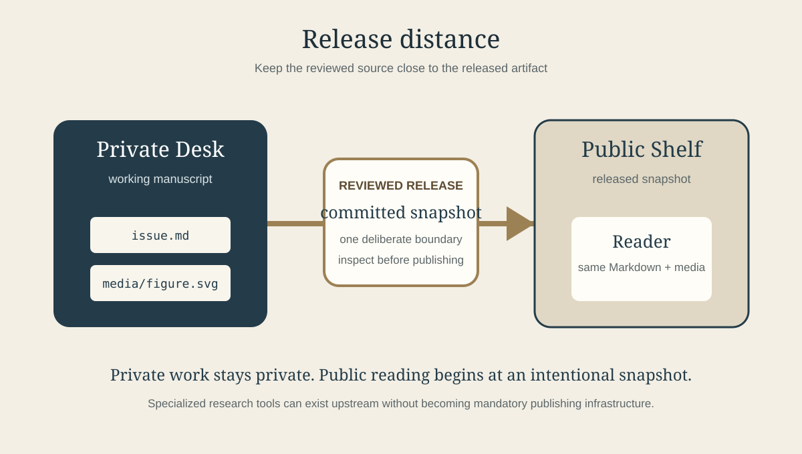

# Portable scholarship

## Editorial

A scholarly publication does not become rigorous because it has a complicated toolchain. It becomes rigorous when readers can inspect claims, follow references, understand methods, and identify the exact version being discussed. Plain-text publishing can support that work surprisingly well when the publication keeps its evidence close to the prose and its revision history visible.

This specimen demonstrates Bookself's intentionally modest scholarly layer. It uses ordinary Markdown for structure, a same-chapter bibliography for citations, a footnote for methodological qualification, a numbered display equation, and a versioned figure. None of those features requires a hosted compiler or CI job.

## Research note: release distance

A useful way to think about reproducible publishing is the **release distance** between a working manuscript and the public artifact a reader sees. The more hidden transformations occur between those states, the more places there are for the published result to diverge from the reviewed source.

For a deliberately simple model, let

$$
D = T + H + U
\label{release-distance}
$$

where $T$ is the number of required transformation steps, $H$ is the number of hosted services required to complete publication, and $U$ is the number of unreviewed state transitions between the committed manuscript and the public release.

Equation \eqref{release-distance} is not a universal measure of publishing quality. It is a design heuristic: when two workflows provide the same editorial guarantees, the one with fewer opaque transitions is easier to inspect and reproduce.[^distance]

Bookself deliberately keeps the required path small: committed Markdown and media move from a private Binder into a public Shelf snapshot, where the static Reader renders them directly. That design follows a broader reproducibility principle: preserve the materials needed to understand and reconstruct a result, and make their provenance legible to later readers [@sandve|Sandve et al., 2013].

The point is not that every scholarly project should avoid specialized tools. Computational notebooks, statistical environments, citation managers, and typesetting systems can all be essential. The point is that each dependency should earn its place. A prose-first article with a table, a figure, and a few equations should not need a complex hosted pipeline merely to remain readable.

## Methods note

This issue is itself the method demonstration. Its source is one Markdown manuscript plus one SVG figure. The publication metadata identifies it as a journal issue with volume, issue, date, and frequency. The Reader can expose the same source using its journal treatment while preserving the ordinary repository structure used by books, reports, and course texts.

The scholarly conventions are intentionally local to this chapter. Citation definitions and footnotes live beside the claims they support; equation labels are chapter-local; the figure is versioned under this publication's `media/` directory. That boundary makes the supported behavior explicit instead of implying a full BibTeX, CSL, or TeX compilation environment that Bookself does not provide.

## Results for authors and instructors

The practical result is a specimen that can be used in three ways. An author can copy the journal starter and see what finished issue metadata looks like. A student can inspect how source, citations, equations, and figures remain ordinary files. An instructor can point to the separation between a working Binder and a released Shelf without exposing next semester's draft.

| Concern | What the specimen demonstrates |
|---|---|
| Citation | Human-readable in-text label with a same-chapter bibliography entry |
| Method note | Footnote attached to the claim it qualifies |
| Mathematics | Inline math plus a numbered, chapter-local display equation |
| Figure | Relative media asset with alt text and a semantic caption |
| Publication identity | Journal, volume, issue, date, frequency, and publisher metadata |
| Release model | Private working copy → deliberate snapshot → public reading copy |

## Discussion

Open scholarship benefits from sophisticated tools when the research requires them, but openness also depends on simplicity at the publication boundary. A durable article should still have an intelligible source, a reviewable history, and an artifact that does not become unreadable merely because a vendor account, build service, or proprietary editor disappears.

That is the role this journal specimen is meant to test inside Bookself: not whether Markdown can imitate every scholarly publishing system, but whether a small, inspectable publication can carry enough scholarly structure to be useful before additional machinery is justified.

## References

[@sandve]: Sandve, G. K., Nekrutenko, A., Taylor, J., & Hovig, E. (2013). Ten simple rules for reproducible computational research. *PLoS Computational Biology, 9*(10), e1003285.

[^distance]: The variables are deliberately qualitative here. A production research workflow could operationalize them differently; the equation exists to demonstrate the Reader's supported math and cross-reference behavior, not to claim a validated metric.
